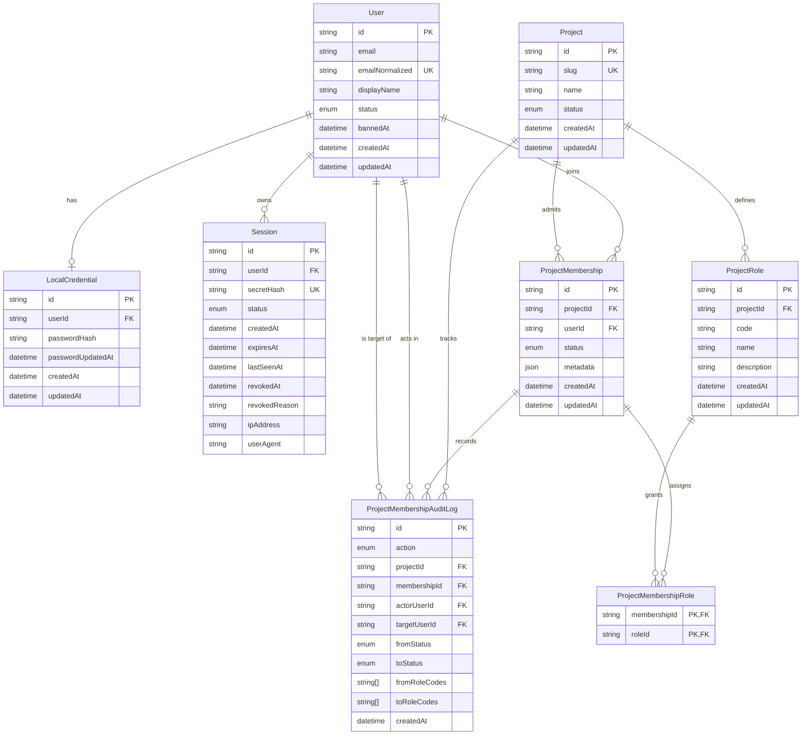

# Database Model

Initial relational model for the first identity slice in `identity-service`.

The current scope is intentionally schema-first: the service documents and
persists centralized identity, local credentials, sessions, projects, and
project-scoped roles before exposing auth endpoints.

Related decision:

- [ADR 0003: Define Initial Identity Data Model](./adrs/0003-define-initial-identity-data-model.md)

## Entities

- `User`: centralized identity record shared across connected projects.
- `LocalCredential`: the initial local `email + password` login material for a
  user.
- `Session`: revocable and renewable server-managed session state.
- `Project`: an application connected to the identity service.
- `ProjectRole`: a role that exists only inside a single project.
- `ProjectMembership`: a user's admission into a project.
- `ProjectMembershipRole`: the role assignments attached to a membership.
- `ProjectMembershipAuditLog`: immutable audit rows for administrative
  membership mutations.

## Cardinality Rules

- One `User` may have zero or one `LocalCredential`.
- One `User` may have many `Session` records.
- One `User` may have many `ProjectMembership` records, but only one per
  project.
- One `Project` may define many `ProjectRole` records.
- One `ProjectMembership` may have many assigned roles.
- One `ProjectMembership` may have many audit log records.
- Role codes are unique inside a project, not across the whole system.
- One `User` may appear in many audit log rows as the acting admin or as the
  target member.

## Role Scope

Role names can overlap across projects without meaning the same thing.

- `other-gpt:user` and `cost-console:user` are different records.
- `other-gpt:admin` and `cost-console:admin` are different records.

This is why the uniqueness constraint is `(projectId, code)` instead of a
global unique role code.

## Bootstrap Role Matrix

Permissions are documented here for clarity, but they are not yet persisted in
relational tables.

### other-gpt

| Role code | Meaning                          | Documented permissions                                                                                       |
| --------- | -------------------------------- | ------------------------------------------------------------------------------------------------------------ |
| `user`    | Baseline signed-in product user. | Standard product usage and access to personal app data allowed by Other GPT.                                 |
| `pro`     | Elevated user tier above `user`. | Includes `user` capabilities plus higher-tier features, limits, or premium model options defined by the app. |
| `admin`   | Project-scoped administrator.    | Includes `pro` capabilities plus user, membership, and administrative management inside Other GPT.           |

### cost-console

| Role code | Meaning                       | Documented permissions                                                                                |
| --------- | ----------------------------- | ----------------------------------------------------------------------------------------------------- |
| `user`    | Standard cost-console user.   | Access to the non-administrative cost and reporting views granted by the app.                         |
| `admin`   | Project-scoped administrator. | Includes `user` capabilities plus elevated views, support workflows, and cost-console administration. |

## Mermaid Diagram

