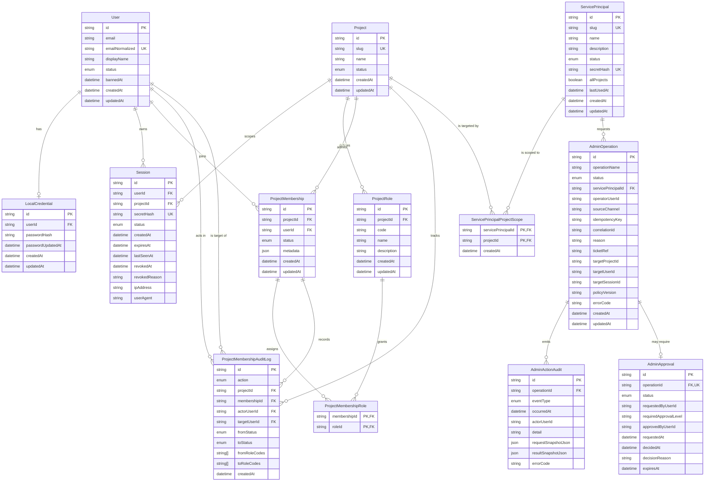

# Database Model

Initial relational model for the first identity slice in `identity-service`.

The current scope is intentionally schema-first: the service documents and
persists centralized identity, local credentials, sessions, projects, and
project-scoped roles before exposing auth endpoints.

Related decision:

- [ADR 0003: Define Initial Identity Data Model](./adrs/0003-define-initial-identity-data-model.md)

## Entities

- `User`: centralized identity record shared across connected projects.
- `LocalCredential`: the initial local `email + password` login material for a
  user.
- `Session`: revocable and renewable server-managed session state scoped to one
  project.
- `Project`: an application connected to the identity service.
- `ProjectRole`: a role that exists only inside a single project.
- `ProjectMembership`: a user's admission into a project.
- `ProjectMembershipRole`: the role assignments attached to a membership.
- `ProjectMembershipAuditLog`: immutable audit rows for administrative
  membership mutations.
- `ServicePrincipal`: a machine identity (e.g. `mcp-server` acting for
  `openclaw-ops`) that authenticates the admin operational surface by bearer
  token. Only the token's `secretHash` is stored.
- `ServicePrincipalProjectScope`: the explicit project allow-list for a service
  principal (irrelevant when `allProjects` is set).
- `AdminOperation`: the single-row anchor per admin operation; holds the
  resolved status, targets, `reason`, and the idempotency key.
- `AdminActionAudit`: append-only milestone events for an admin operation, with
  redacted request/result snapshots.
- `AdminApproval`: live approval state (at most one per operation) for high-risk
  actions that require a deliberate confirmation step before they take effect.

## Cardinality Rules

- One `User` may have zero or one `LocalCredential`.
- One `User` may have many `Session` records.
- One `Project` may have many `Session` records.
- One `User` may have many `ProjectMembership` records, but only one per
  project.
- One `Project` may define many `ProjectRole` records.
- One `ProjectMembership` may have many assigned roles.
- One `ProjectMembership` may have many audit log records.
- Role codes are unique inside a project, not across the whole system.
- One `User` may appear in many audit log rows as the acting admin or as the
  target member.
- One `ServicePrincipal` may be scoped to many projects through
  `ServicePrincipalProjectScope`; one `Project` may be in many principals' scopes.
- One `ServicePrincipal` may own many `AdminOperation` rows.
- One `AdminOperation` may emit many `AdminActionAudit` rows and has at most one
  `AdminApproval`.
- A service principal's `idempotencyKey` is unique per
  `(servicePrincipalId, idempotencyKey)` on `AdminOperation`, so a retried call
  resolves to the original operation.

## Role Scope

Sessions are also project-scoped. A session issued for `other-gpt` cannot be
used to authenticate requests for `cost-console`, even when both belong to the
same underlying `User`.

Role names can overlap across projects without meaning the same thing.

- `other-gpt:user` and `cost-console:user` are different records.
- `other-gpt:admin` and `cost-console:admin` are different records.

This is why the uniqueness constraint is `(projectId, code)` instead of a
global unique role code.

## Admin operational surface (machine identity)

These entities back the machine-to-machine admin surface and are separate from
the cookie/session model above. Related decisions:

- [ADR 0008: Admin Operational Surface with Service-Principal Auth and Risk-Based Approval](./adrs/0008-adopt-admin-operational-surface-with-service-principal-and-risk-approval.md)
- [ADR 0009: Readmission of Revoked Memberships via Approval](./adrs/0009-support-readmission-of-revoked-memberships-via-approval.md)

A `ServicePrincipal` authenticates globally by bearer token and targets a single
project per operation through `AdminOperation.targetProjectId`; it never re-logs
in per project. Project reach is least-privilege: either `allProjects = true`
(the global `openclaw-ops` grant) or the explicit `ServicePrincipalProjectScope`
allow-list.

Each operation is anchored by one `AdminOperation` row, which carries the
idempotency key (so retries resolve to the original outcome). Milestone events
are appended to `AdminActionAudit`, and high-risk operations hold a single live
`AdminApproval` until they are confirmed through `decideApproval`. This trail is
distinct from
`ProjectMembershipAuditLog`, which keeps tracking cookie-surface membership
mutations (now including the `READMITTED` action).

## Bootstrap Role Matrix

Permissions are documented here for clarity, but they are not yet persisted in
relational tables.

### other-gpt

| Role code | Meaning                          | Documented permissions                                                                                       |
| --------- | -------------------------------- | ------------------------------------------------------------------------------------------------------------ |
| `user`    | Baseline signed-in product user. | Standard product usage and access to personal app data allowed by Other GPT.                                 |
| `pro`     | Elevated user tier above `user`. | Includes `user` capabilities plus higher-tier features, limits, or premium model options defined by the app. |
| `admin`   | Project-scoped administrator.    | Includes `pro` capabilities plus user, membership, and administrative management inside Other GPT.           |

### cost-console

| Role code | Meaning                       | Documented permissions                                                                                |
| --------- | ----------------------------- | ----------------------------------------------------------------------------------------------------- |
| `user`    | Standard cost-console user.   | Access to the non-administrative cost and reporting views granted by the app.                         |
| `admin`   | Project-scoped administrator. | Includes `user` capabilities plus elevated views, support workflows, and cost-console administration. |

## Mermaid Diagram

```mermaid
erDiagram
    User ||--o| LocalCredential : "has"
    User ||--o{ Session : "owns"
    User ||--o{ ProjectMembership : "joins"
    Project ||--o{ Session : "scopes"
    Project ||--o{ ProjectRole : "defines"
    Project ||--o{ ProjectMembership : "admits"
    Project ||--o{ ProjectMembershipAuditLog : "tracks"
    ProjectMembership ||--o{ ProjectMembershipRole : "assigns"
    ProjectMembership ||--o{ ProjectMembershipAuditLog : "records"
    ProjectRole ||--o{ ProjectMembershipRole : "grants"
    User ||--o{ ProjectMembershipAuditLog : "acts in"
    User ||--o{ ProjectMembershipAuditLog : "is target of"
    ServicePrincipal ||--o{ ServicePrincipalProjectScope : "is scoped to"
    Project ||--o{ ServicePrincipalProjectScope : "is targeted by"
    ServicePrincipal ||--o{ AdminOperation : "requests"
    AdminOperation ||--o{ AdminActionAudit : "emits"
    AdminOperation ||--o| AdminApproval : "may require"

    User {
        string id PK
        string email
        string emailNormalized UK
        string displayName
        enum status
        datetime bannedAt
        datetime createdAt
        datetime updatedAt
    }

    LocalCredential {
        string id PK
        string userId FK
        string passwordHash
        datetime passwordUpdatedAt
        datetime createdAt
        datetime updatedAt
    }

    Session {
        string id PK
        string userId FK
        string projectId FK
        string secretHash UK
        enum status
        datetime createdAt
        datetime expiresAt
        datetime lastSeenAt
        datetime revokedAt
        string revokedReason
        string ipAddress
        string userAgent
    }

    Project {
        string id PK
        string slug UK
        string name
        enum status
        datetime createdAt
        datetime updatedAt
    }

    ProjectRole {
        string id PK
        string projectId FK
        string code
        string name
        string description
        datetime createdAt
        datetime updatedAt
    }

    ProjectMembership {
        string id PK
        string projectId FK
        string userId FK
        enum status
        json metadata
        datetime createdAt
        datetime updatedAt
    }

    ProjectMembershipRole {
        string membershipId PK, FK
        string roleId PK, FK
    }

    ProjectMembershipAuditLog {
        string id PK
        enum action
        string projectId FK
        string membershipId FK
        string actorUserId FK
        string targetUserId FK
        enum fromStatus
        enum toStatus
        string[] fromRoleCodes
        string[] toRoleCodes
        datetime createdAt
    }

    ServicePrincipal {
        string id PK
        string slug UK
        string name
        string description
        enum status
        string secretHash UK
        boolean allProjects
        datetime lastUsedAt
        datetime createdAt
        datetime updatedAt
    }

    ServicePrincipalProjectScope {
        string servicePrincipalId PK, FK
        string projectId PK, FK
        datetime createdAt
    }

    AdminOperation {
        string id PK
        string operationName
        enum status
        string servicePrincipalId FK
        string operatorUserId
        string sourceChannel
        string idempotencyKey
        string correlationId
        string reason
        string ticketRef
        string targetProjectId
        string targetUserId
        string targetSessionId
        string policyVersion
        string errorCode
        datetime createdAt
        datetime updatedAt
    }

    AdminActionAudit {
        string id PK
        string operationId FK
        enum eventType
        datetime occurredAt
        string actorUserId
        string detail
        json requestSnapshotJson
        json resultSnapshotJson
        string errorCode
    }

    AdminApproval {
        string id PK
        string operationId FK, UK
        enum status
        string requestedByUserId
        string requiredApprovalLevel
        string approvedByUserId
        datetime requestedAt
        datetime decidedAt
        string decisionReason
        datetime expiresAt
    }
```
